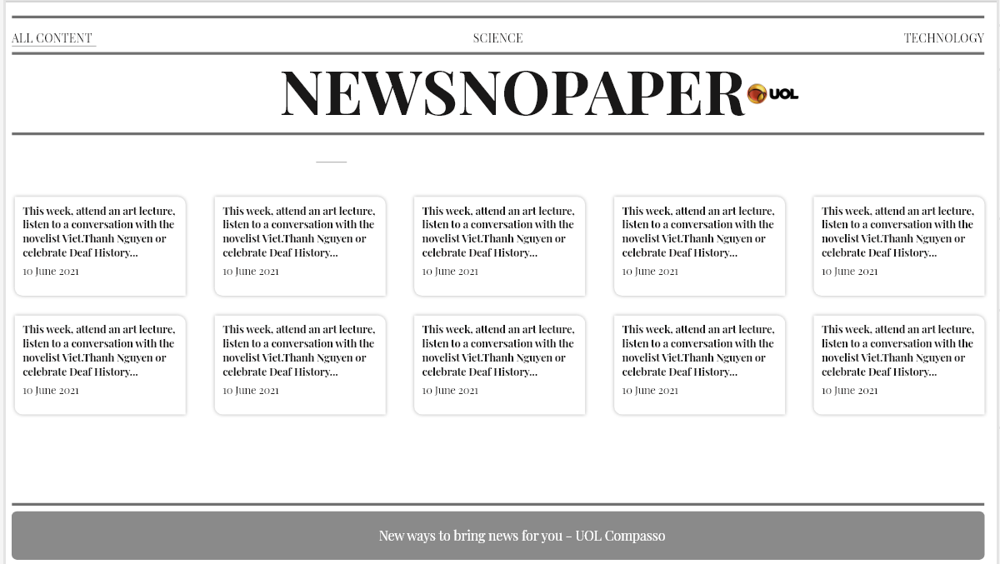

[![LinkedIn][linkedin-shield]][linkedin-url]


<!-- PROJECT LOGO -->
<br />
<p align="center">
  <a href="https://github.com/FellipeCarvalho/teste-react-uolcompasso">
    
  </a>

  <h3 align="center"> Aplicação com exibição de notícias do New York Times - Teste UOL Compasso </h3>

  <p align="center">
    Notícias de Ciência e Tecnologia consumidas da Api do New York Times
    <br />
    <a href="https://github.com/FellipeCarvalho/teste-react-uolcompasso/"><strong>Explore o conteúdo »</strong></a>
    <br />
    <br />
<p align="center">
    <a href="https://github.com/FellipeCarvalho/teste-react-uolcompasso/issues">Reporte Bugs</a>
    ·
    <a href="https://api.whatsapp.com/send?phone=5541998290782&text=Ol%C3%A1%20Fellipe%2C%20gostaria%20de%20te%20dar%20o%20feedback%20sobre%20o%20seu%20Teste%20na%20UOL%20Compasso.">Envie seu feedback </a>
  </p>
</p>


<!-- TABLE OF CONTENTS -->
<details open="open">
  <summary>Conteúdo</summary>
  <ol>
    <li>
        <a href="#Sobre-o-Projeto">Sobre o Projeto</a>
        <ul>
          <li><a href="#desenvolvido-com">Tecnologia utilizada</a></li>
        </ul>
    </li>
      <li> 
         <a href="#Iniciando">Iniciando</a>
      <ul>
        <li><a href="#Pre-requisitos">Pré-requisitos</a></li>
        <li><a href="#Configuracao">Configuração</a></li>
      </ul>
    </li>
    <li><a href="#Contato">Contato</a></li>

  </ol>
</details>


<!-- ABOUT THE PROJECT -->
## Sobre o Projeto
<p align="center">
  <a href='https://github.com/rodrigo-oliveira-compasso/teste-react'>
    
  </a>
</p>

Descrição do teste: https://github.com/rodrigo-oliveira-compasso/teste-react


Essa foi uma aplicação utilizando a plataforma nodejs e framework reactjs. O backend serviu para basicamente fazer criar uma api que consume direto da api do NYT. Usado o cors para liberar a api para o frontend(a api do NYT poderia ser consumida diretamente do frontend).

No front optei por utilizar o Styled components pelo fato de mapear melhor os componentes, embora possa parecer verboso, a manutenção pode ficar mais rápida.Usei algumas dependências para facilitar o tratamento de dados como o date-nfs que ajuda na manipulação de datas.
O axios usei para realizar a conexão com a api do backend.

                                                             

### Desenvolvido com :

Principais tecnologias: 
* [React](https://reactjs.org/)
* [Nodejs](https://nodejs.org/en/)

Principais Dependências:
* [Styled Components](https://styled-components.com/)
* [Axios](https://www.npmjs.com/package/axios)
* [Date nfs](https://date-fns.org/)
* [Express](https://expressjs.com/)
* [Cors](https://www.npmjs.com/package/cors)


<!-- GETTING STARTED -->
## Iniciando

**Acesso a aplicação**
Ao acessar http://localhost:3000

**Funcionalidades**
1. Ao carregar o endereço http://localhost:3000 já estará com o título das notícias do NYT distribuídas em cartões dinamicamente;
2. Para escolher o tipo de assunto das noticias que deseja visualizar(ciência ou Tecnologia), basta clicar no menu que fica no topo da página e selecionar o assunto desejado.
3. Ao clicar no cartão da notícia irá abrir um modal com os seguinte dados: Título, assunto e a sua url da notícia.
4. Para sair do modal, basta clicar em qualquer parte da tela

**Veja o Protótipo:**
 Veja o Protótipo :https://xd.adobe.com/view/9a1ad5ef-25d2-42cb-9d55-aadd0be93ef2-cf49/ 

### Pre requisitos

* Node instalado

### Configuracao

*Faça o clone desse repositório*

**Iniciando o Backend**
a)Na pasta Backend executar o comando:
   ``` npm install  ```
b)Assim que finalizar a instalação do node_modules, executar o comando:
   ``` npm start  ```
O backend estará disponível no endereço: http://localhost:3333

**Iniciando o Frontend**
a) Na pasta Frontend/web executar o comando
   ``` npm install  ```
b)Assim que finalizar a instalação do node_modules, executar o comando:
   ``` npm start  ```
Após feito essas etapas, o projeto poderá ser acessado nesse endereço: http://localhost:3000  


<!-- CONTACT -->
## Contato

Fellipe Carvalho - [https://br.linkedin.com/in/fellipe-carvalho-6b688190](https://br.linkedin.com/in/fellipe-carvalho-6b688190) - fellipealbert3@gmail.com

Link do Projeto: [https://github.com/FellipeCarvalho](https://github.com/FellipeCarvalho/teste-react-uolcompasso)


<!-- MARKDOWN LINKS & IMAGES -->
<!-- https://www.markdownguide.org/basic-syntax/#reference-style-links -->
[contributors-shield]: https://img.shields.io/github/contributors/othneildrew/Best-README-Template.svg?style=for-the-badge
[contributors-url]: https://github.com/othneildrew/Best-README-Template/graphs/contributors
[forks-shield]: https://img.shields.io/github/forks/othneildrew/Best-README-Template.svg?style=for-the-badge
[forks-url]: https://github.com/othneildrew/Best-README-Template/network/members
[stars-shield]: https://img.shields.io/github/stars/othneildrew/Best-README-Template.svg?style=for-the-badge
[stars-url]: https://github.com/othneildrew/Best-README-Template/stargazers
[issues-shield]: https://img.shields.io/github/issues/othneildrew/Best-README-Template.svg?style=for-the-badge
[issues-url]: https://github.com/othneildrew/Best-README-Template/issues
[license-shield]: https://img.shields.io/github/license/othneildrew/Best-README-Template.svg?style=for-the-badge
[license-url]: https://github.com/othneildrew/Best-README-Template/blob/master/LICENSE.txt
[linkedin-shield]: https://img.shields.io/badge/-LinkedIn-black.svg?style=for-the-badge&logo=linkedin&colorB=555
[linkedin-url]: https://linkedin.com/in/fellipe-carvalho-6b688190
[product-screenshot]: images/screenshot.png
